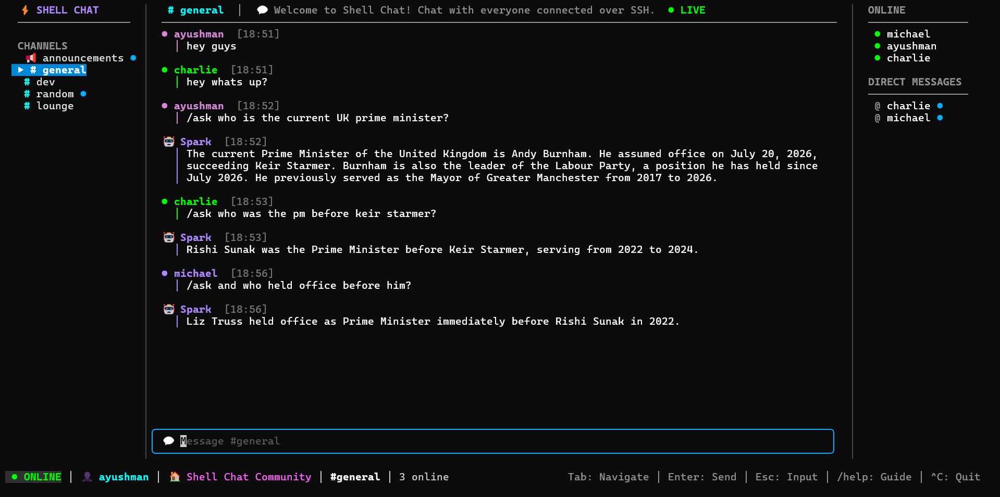

# ⚡ Shell Chat

> A modern, Discord-like real-time chat application in your terminal, accessed exclusively over standard SSH. Built with Go, Bubble Tea, and Charm Wish.

[](https://golang.org)
[](LICENSE)
[]()
[]()

---

## 📸 Interface

<p align="center">
  
</p>

---

## ✨ Features

- **🌐 Zero Client Install** — Connect from any terminal on Windows, macOS, Linux, or Android (Termux) with standard OpenSSH: `ssh <server_ip> -p 10000`.
- **🔐 Interactive Authentication & User Settings** — Register and login directly inside the terminal. Change your username or password anytime with `/settings` (with retroactive history renaming across all channels & DMs).
- **🤖 Spark AI Assistant (Real-Time Search Grounding)** — Ask any question using `/ask <prompt>`. Powered by **Google Gemini** with **Live Real-Time Web Search Grounding**.
- **👥 Multi-User Group Memory & Preference Isolation** — Spark participates in group channels naturally, tracking ongoing group discussions across multiple participants while keeping individual user facts and preferences strictly separated (like Meta AI in group chats).
- **📢 Dedicated Read-Only `#announcements` Channel** — Server-wide broadcasts for new user joins and username changes with centered, scrollable typography.
- **💬 Channels & Direct Messages (DMs)** — Real-time group messaging across `#general`, `#dev`, `#random`, `#lounge`, and 1-on-1 private DMs.
- **🟢 Online Members Sidebar** — Live presence sidebar showing active users with deterministic 32-color ANSI user badges.
- **🔍 Message History Search** — Search past messages instantly across any channel or DM with `/search <query>`.
- **🧮 Fast Math Calculator** — Evaluate arithmetic and scientific expressions with `/calc <expression>`.
- **⏰ Localized 24h Time & Timezones** — 24-hour timestamps with live timezone switching via `/tz <offset/name>` (e.g. `/tz IST`, `/tz UTC`, `/tz +5:30`).
- **🛡️ Admin Dashboard (TUI)** — Role-based access control (RBAC). Admins can press `F10` to view real-time system health and PostgreSQL-powered analytics natively inside the terminal.
- **🚀 Event-Driven Microservices Architecture** — Built for peta-byte scale data processing. The Go gateway handles high-concurrency SSH multiplexing and pushes events to an **Apache Kafka** cluster.
- **🐘 Polyglot Persistence** — Uses **PostgreSQL** for relational identity management (Users, RBAC) and analytics, with **In-Memory** fallback for blazing-fast local development message storage.
- **🐍 Agentic AI & Analytics Microservice** — A separate **Python FastAPI** service consumes the Kafka event stream in real-time to compute "Trending Words" and perform background AI grounding tasks.

---

## 🏗️ Architecture

Shell Chat utilizes a distributed microservices architecture tailored for massive scale:

1. **The Go Gateway (Monolith/TUI)**: Intercepts standard SSH connections and renders a Bubble Tea TUI. It handles real-time concurrency via an internal Actor Model.
2. **Apache Kafka (Event Streaming)**: The backbone of the system. Every message is published to Kafka topics, guaranteeing durable, distributed event processing.
3. **PostgreSQL (Identity & Analytics)**: Stores relational data like user roles and aggregates real-time metrics computed by background services.
4. **Python Analytics Service (Agentic AI)**: An independent microservice that consumes the Kafka stream to analyze real-time chat data, updating Postgres metrics seamlessly via REST and background workers.
5. **In-Memory Message Store**: Chat message history is currently stored in-memory, making the app blazingly fast and requiring zero configuration for local development.

---

## 🚀 Getting Started

### 1. Run the Server

Requires [Go 1.21+](https://go.dev/dl/):

```bash
# Clone the repository
git clone https://github.com/ayushman-77/shell-chat.git
cd shell-chat

# (Optional) Configure your Gemini API key in .env for Spark AI
# Get a free key from https://aistudio.google.com/apikey
echo "GEMINI_API_KEY=your_gemini_api_key_here" > .env

# Run the server (runs out of the box with zero external dependencies)
go run ./cmd/server
```

### 2. Connect to the Chat

Open any terminal on any device and connect:

```bash
# Connect locally
ssh localhost -p 10000

# Or connect to your remote cloud server
ssh your-server-ip -p 10000

# Optional: Add to your ~/.ssh/config for quick access!
# Host shell-chat
#     HostName localhost
#     Port 10000
#
# Then just type:
# ssh shell-chat
```

### 3. Run with Docker

If you prefer using Docker, the entire microservices stack (Go Gateway, PostgreSQL, Kafka, Python Analytics) is fully containerized with Docker Compose:

```bash
# Build and run the entire stack in detached mode
docker-compose up -d --build

# The chat server will be available at:
# ssh localhost -p 10000
```

---

## ⌨️ Controls & Keybindings

| Key / Command | Action |
|---|---|
| `Tab` | Cycle focus: **Input** ➔ **Channels** ➔ **Chat Scroll** ➔ **Online/DMs** |
| `PgUp` / `PgDn` | Scroll message history up / down (or `Ctrl+U` / `Ctrl+D`) |
| `↑` / `↓` | Navigate channels, online members, or scroll line-by-line in Chat Scroll mode |
| `Enter` | Send message / Open selected channel or DM |
| `Esc` | Return focus directly to chat input & jump to bottom |
| `/help` | Open the interactive keyboard shortcuts and commands guide |
| `/settings` | Open profile settings modal (update username/password) |
| `/ask <prompt>` | Ask **Spark (🤖)** a question (grounded with real-time web search) |
| `/calc <expr>` | Calculate math expressions (e.g. `/calc (1024 * 768) / 8`, `/calc sqrt(144)`) |
| `/search <kw>` | Search past messages in current channel/DM (e.g. `/search deploy`) |
| `/tz <offset>` | Change timezone (e.g. `/tz IST`, `/tz +5:30`, `/tz UTC`, `/tz EST`) |
| `F10` | Toggle **Admin Dashboard** (Requires `admin` role in PostgreSQL) |
| `Ctrl + C` | Disconnect and quit |

---

## 🛠️ Building Binaries

```bash
# For Windows
go build -ldflags="-s -w" -o shell-chat.exe ./cmd/server

# For Linux (x86_64 / amd64 Cloud VMs)
GOOS=linux GOARCH=amd64 go build -ldflags="-s -w" -o shell-chat-linux ./cmd/server

# For ARM / Raspberry Pi / Apple Silicon
GOOS=linux GOARCH=arm64 go build -ldflags="-s -w" -o shell-chat-arm64 ./cmd/server
```

---

## 📄 License

Distributed under the [MIT License](LICENSE).